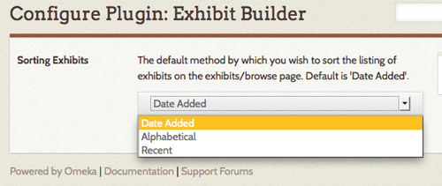
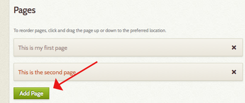
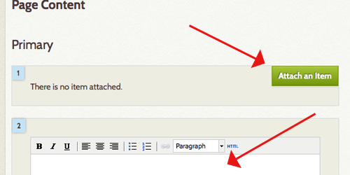

**Note** This is an older version of Exhibit Builder and is no longer being updated. The current version of [Exhibit Builder is 3](/ExhibitBuilder_3.0.md)

The Exhibit Builder plugin allows you to develop online exhibits, or special web pages, that combine items from your Omeka archive with narrative text.

Exhibits are composed of pages--generally an initial page that
introduces your exhibit and subsequent pages composed of the items from your Omeka database that you wish to highlight and/or relate to each other. Exhibits compiled with Exhibit Builder may be one or several pages long and may include a variety of layouts which you may chose from a selection of page templates.

Configuring
--------------------------------------------------------------
This plugin is included in your Omeka installation and does not require a separate download. Select Plugins in the top navigation of your admin. Activate your plugin and select Conflgure to choose the sequence in which your exhibits appear.

 
-   Choose the order of your Browse Page Exhibit display from the dropdown menu.
-   Don't forget to save your changes.

Getting Started 
----------------------------------------------------------------

After you have configured the Exhibit Builder plugin, select Exhibits from your lefthand nav bar, and on the Browse Exhibits page, select Add An Exhibit.

-   On the Exhibit Metadata page, fill in fields governing your public display
    -   Title: the official name of your exhibit
    -   Slug: an abbreviated exhibit name that appears in the website URL, e.g. <http://myomekasite/exhibits/show/exhibitname>
    -   Credits: acknowledgements you would like to appear on the public site
    -   Description: an overview or introduction to your exhibit
    -   Tags: associate your exhibit items with others in your Omeka archive

-   Theme: You may select the design theme appropriate to your exhibit. The default theme is the theme you have selected for your Omeka archive. In the dropdown menu, you may select a different theme to customize the exhibit.

-   To customize your exhibit theme, select the Configure button. You'll be directed to the theme configuration page to make changes for your exhibit display.
-   Decide whether your exhibit will be public and/or featured on the home page of your site and check the appropriate boxes under the Save Changes button.
-   Don't forget to save your changes.

Pages
-------------------------------------------------
When you have completed the Exhibit Metadata, you are ready to add pages to build your exhibit. Pages, beneath your Exhibit Metadata options, enables you to add, edit, delete, nest and order pages in your exhibit.

### Add Page

-   Select Add Page at the bottom of the Exhibit Metadata page. A new window opens including Page Metadata fields and layouts.
-   Complete the page metadata fields:
    -   Title: the formal title of the page
    -   Slug: a shortened title visible in your page URL, e.g. <http://myomekasite/exhibits/show/exhibitname/pagename>
-   Select a page layout from among the template thumbnails. You may select a different layout for each page of your exhibit.
-   Select Save and Add Another Page if you are continuing to build the exhibit or select Save Changes.

### Edit Page
To change page layout, title, or slug, select edit page under page layout.
-   Make changes in the new window.
-   Don't forget to save your changes.

### Delete page
-   To delete a page, return to Exhibit Metadata. Under Pages, select the X in the upper right hand corner of the page title. The title field will change color.
-   Select Save Changes to delete the page. (Note that the Delete button deletes the entire exhibit--but don't worry, you'll be asked to confirm the Delete Exhibit selection.)

## Order and Nest Pages

To nest pages, drag and drop titles to the desired location. You may create parent, child, and grandchild nests with multiple pages on each level.

To change the order of your exhibit pages, drag and drop them in the desired sequence.

Add Content
-------------------------------------------------------------

Each page layout template offers a unique configuration for adding content to your exhibit. Generally, to add an content from your Omeka archive to the page, select Attach an Item. Many layouts will also display fields for adding captions and descriptive text to your selected items with options for customizing fonts and presentation style.

-   Select Attach an Item

-   A lightbox opens with a list of items from the archive for you to browse or to search.
-   To add an item to the page, select the title, then select Attach Selected Item button in the bottom right of the lightbox. If the item you select includes multiple files, you will be asked to select the file you wish to attach to your exhibit page.
-   Closing the lightbox returns you to your Page Content section where you may add captions and descriptive text according to the layout you have selected.
-   When you have finished creating your page, don't forget to save your changes.

Note that you may edit your page layout, add or delete items to a page, change your text and otherwise alter your exhibits at any time. Just remember to save your changes!