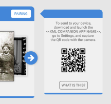
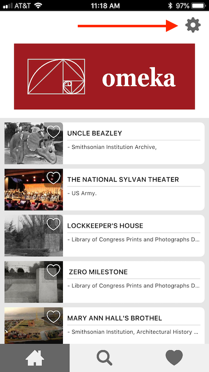
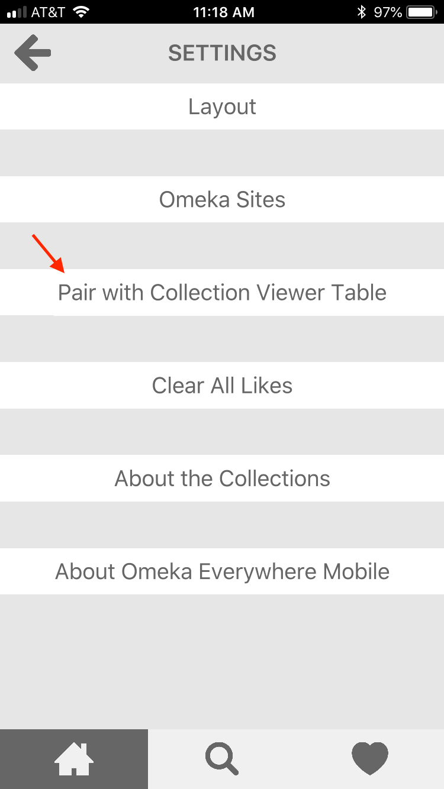

Heist is a plugin designed to work with installations of [Omeka Everywhere](http://omeka.org/everywhere/). This plugin facilitates connections between multi-touch devices running the Omeka Everywhere Collection Viewer and mobile devices with the Omeka Everywhere Mobile App.

This plugin is only useful for organizations and individuals running Omeka Everywhere. 

## Activation

Heist has no configuration options. Simply install and activate. You can install Heist before or after setting up your Omeka Everywhere Collection Viewer and/or Mobile App instances. 

## Using Heist
In order to use Heist, you must have a mobile device with the Omeka Everywhere app installed (iOS, Android) and access to a touch-enabled device running Omeka Everywhere Collection Viewer. 

From the Collection Viewer, visitors click the Send to Mobile button on their dock. This will open up a side window with a QR code.

Next, the visitor opens the app on their phone and clicks the gear in the upper right corner of the home screen to open the Settings. 

From there they select the Pair with Collection Viewer Table button.

At this point they may need to give the app permission to use the camera. The app will open a camera view through which they can scan the QR code on the table, which should complete the pairing.

Once paired, visitors can save items from the Collection Viewer to their app by dragging and dropping the item from the active area of the table to the pairing point in their dock on the table. 