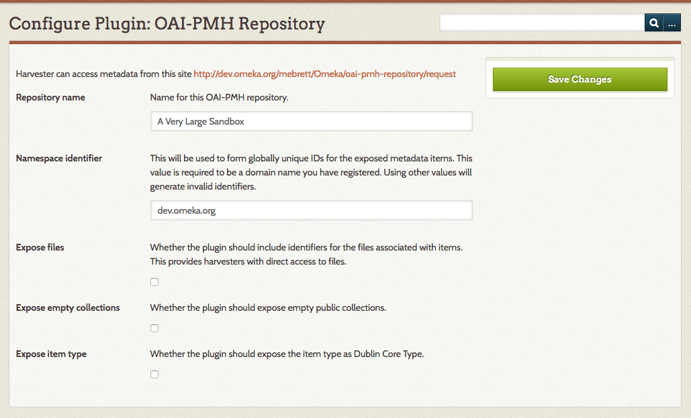

*Current version: 2.1.1*

The OAI-PMH Repository plugin exposes metadata for Omeka items using the [Open Archives Initiative Protocol for Metadata Harvesting](http://www.openarchives.org/pmh). This is the reverse of the functionality provided by the [OAI-PMH Harvester plugin](/OaipmhHarvester.md).

Metadata Formats
------------------------------------------------------------
The repository plugin ships with support for four standard metadata formats:
- [Dublin Core](http://dublincore.org) (oai\_dc) 
    - This is required by the OAI-PMH specification for all repositories. Omeka metadata fields are mapped one-to-one with fields for this output format, and it is the preferred format to use with the plugin.
- [CDWA Lite](http://www.getty.edu/research/conducting_research/standards/cdwa/cdwalite.html) (cdwalite)
    - The mapping between Omeka's metadata and CDWA Lite metadata is more complicated, and certain fields may not be populated correctly. The chief advantage of using CDWA Lite output is that file URLs can be output in a controlled format, unlike Dublin Core. Harvesters may therefore be able to harvest or link to files in addition to metadata.
- [MODS](http://www.loc.gov/standards/mods/) (mods)
    - This output crosswalks the Dublin Core metadata to MODS using the [mapping](http://www.loc.gov/standards/mods/dcsimple-mods.html) recommended by the Library of Congress.
- [METS](http://www.loc.gov/standards/mets/)
    - The Metadata Encoding and Transmission Standard exposes files to harvesters.

The plugin uses an extensible architecture, and additional or custom metadata formats may be added. See Extending (below) for more details.

Configuration
-------------------------------------------------------------
The plugin has several user-configurable values. You will be prompted to set these at installation time, or you can change them at any time from the Configure link on the plugin management page.

-   *Repository name*
    -   Name for this OAI-PMH repository. This value is sent as part of the response to an Identify request, and it is how the repository will be identified by well-behaved harvesters.
    -   Default: The name of the Omeka installation.
-   Namespace identifier
    -   The [oai-identifier specification](http://www.openarchives.org/OAI/2.0/guidelines-oai-identifier.htm) requires repositories to specify a namespace identifier. This will be used to form globally unique IDs for the exposed metadata items. This value is required to be a domain name you have registered. Using other values will generate invalid identifiers.
    -   Default: "default.must.change" This is intended to be a not-so-subtle hint that the default value is inappropriate. The plugin will function with this, or any other string, as the namespace identifier, but this breaks the assumption that each identifier is globally unique. Best practice is to set this value to the domain name the Omeka server is published at, possibly with a prefix like "oai”.
-   Expose files
    -   Whether the repository should expose direct URLs to all the files associated with an item as part of its returned metadata. This gives harvesters the ability to directly access the files described by the metadata.
    -   Default: true

### Advanced Configuration 

The plugin also allows you to configure some more options about how the repository responds to harvesters. Since the default values are recommended for most users, these values must be edited by hand, in the `config.ini` file in the plugin's root directory.

-   List response limit
    -   Number of individual items that can be returned in a response at once. Larger values will increase memory usage but reduce the number of database queries and HTTP requests. Smaller values will reduce memory usage but increase the number of DB queries and requests.
    -   Default: 50

-   List expiration time
    -   Amount of time in minutes a resumptionToken is valid for. The specification suggests a number in the tens of minutes. This boils down to the length of time a harvester has to request the next part of an incomplete list request.
    -   Default: 10 (minutes)

Extending 
-----------------------------------------------------------
This plugin is designed to allow output to arbitrary metadata formats. To add a new format, add a new file to the `metadata` directory, and in the file declare a class extending `OaiPmhRepository_Metadata_Abstract`.
The only function you must declare is appendRecord, which appends the appropriate XML to the response. You can use the metadata formats shipped with the plugin as examples.

Important notes:

-   The class name should be in the `OaiPmhRepository_Metadata` hierarchy
-   The class name must match the file name (i.e., if you create a class `OaiPmhRepository_Metadata_Foo`, the filename must be `Foo.php`.

Use 
-----------------------------------------------
The base URL of the repository can be found by appending
`/oai-pmh-repository/request` to the base URL of your Omeka site.

