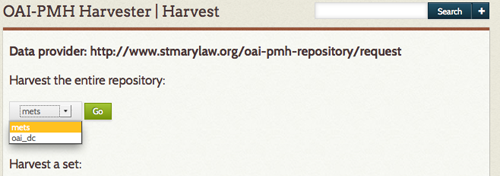

The OAI-PMH Harvester plugin imports records from OAI-PMH data providers.

Some online repositories expose their metadata through the [Open Archives Initiative Protocol for Metadata Harvesting](http://www.openarchives.org/pmh/) (OAI-PMH). This plugin makes it possible to harvest that metadata, mapping it to the Omeka data model. The plugin can be used for one-time data transfers, or to keep up-to-date with changes to an online repository.

Currently the plugin is able to import [Dublin Core](http://dublincore.org/documents/dces/), [CDWA Lite](http://www.getty.edu/research/conducting_research/standards/cdwa/cdwalite.html) metadata, and [METS](http://www.loc.gov/standards/mets/). Dublin Core is an internationally recognized standard for describing any resource. 

Every OAI-PMH data provider should implement this standard. CDWA Lite is a standard for describing works of art and material culture. Very few repositories expose CDWA Lite, but the standard is getting more and more popular. METS is developed as an initiative of the Digital Library Federation and maintained in the Network Development and MARC Standards Office of the Library of Congress.

Installation 
---------------------------------------------------------------
Your server must have PHP-CLI installed.

Upload and [install](../Admin/Adding_and_Managing_Plugins.md) the OAI-PMH Harvester plugin.

Instructions
-----------------------------------------------------------------

### Performing a harvest 
To perform a harvest, go to the OAI-PMH Harvester tab in the left-hand navigation bar.

-   Enter an OAI-PMH base URL, click "View Sets" Not all repository utilize METS. However, if you are accessing a repository utilizing a mets metadata library, you will be given the choice to harvest either oai-dc or mets. Select the type of data you will harvest from the dropdown menu. 

    - To harvest the entire repository, select Go.
    - To harvest single sets within a repository, select the type of data you are harvesting from an individual set, mets or oai-dc (if the choice exists) and select the Go link associated with that set.

The harvest process runs in the background and may take a while. Go to the harvest's "Status" page to check the progress

If you encounter errors, submit the base URL and status messages to the Omeka forums

### Re-harvesting and updating 
The harvester includes the ability to make multiple successive harvests from a single repository, keeping in sync with changes to that repository.

After a repository or set has been successfully harvested, a "Re-harvest" button will be added to its entry on the OAI-PMH Harvester page. Clicking this button will harvest from that repository again using all the same settings, adding new items and updating previously-harvested items as necessary.

Manually specifying the exact same harvest to be run again (same base URL, set, and metadata prefix) will result in the same behavior.

### Duplicate items 
Duplicate items (multiple Omeka items corresponding to the same repository record) can be created if an item in a repository is a member of several OAI-PMH sets. This will also occur if a repository is harvested using more than one metadata prefix. In this case, the duplicate items are independent, and changes to one will not propagate to the others.

However, the duplicate items, if any, can be accessed from the admin item show page. If an item has duplicates, they will be shown in an infobox on the right-hand side of the page titled "Duplicate Harvested Items."

### Delete Harvest
It is possible to undo a harvest, deleting all imported items. 

To do so:

-   Click on the OAI-PMH Harvester in the left hand navigation of your admin dashboard. There will be a table of completed and in-progress Harvests; the far right column is Status.
-   Click on the status (Completed) of the harvest you wish to undo. Do not click the green re-harvest button.
-   The next page will give you a report on the harvest. Click the Delete Items button at the bottom of the table.

The plugin will return you to the OAI-PMH Harvester tab. The displayed status of the harvest will not change until all harvested items are complete, at which point status will be “Deleted.” Deleted harvests do not have a green Re-Harvest button.

Upgrading from Omeka Classic 1.x
-----------------------------------------------------------

The data stored by the harvester plugin has changed between versions, so when upgrading, it is necessary to uninstall the old version of the plugin first. This will remove data stored by the harvester, but the harvested items themselves will remain.

To upgrade the plugin:

1.  Uninstall the old version of the OAI-PMH Harvester plugin from the admin panel.
2.  Replace the OaipmhHarvester directory with the updated version.
3.  Install the now-updated OAI-PMH Harvester plugin from the admin panel.
