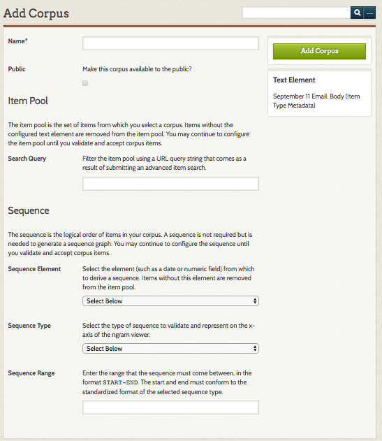
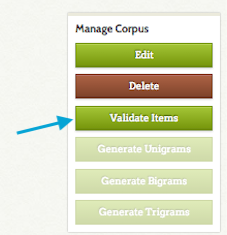
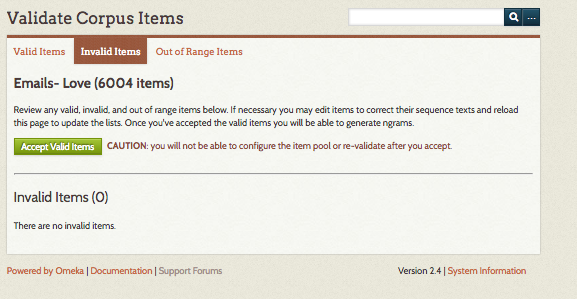
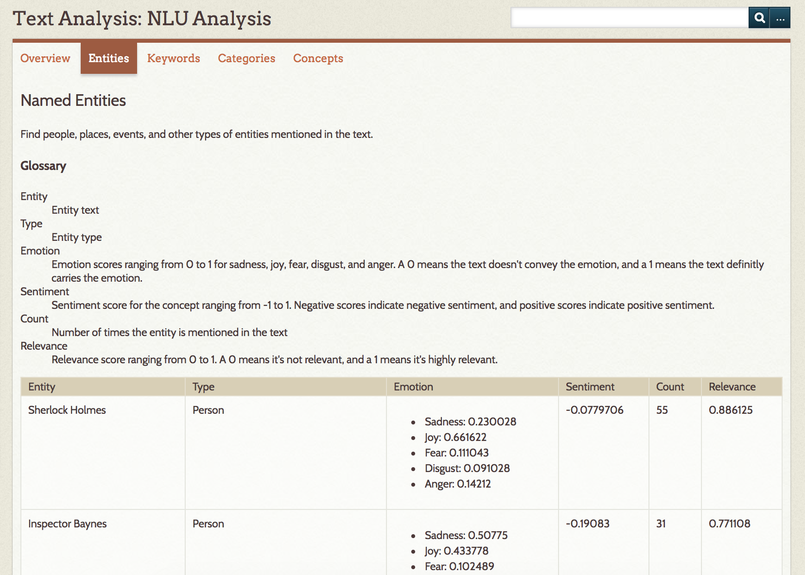
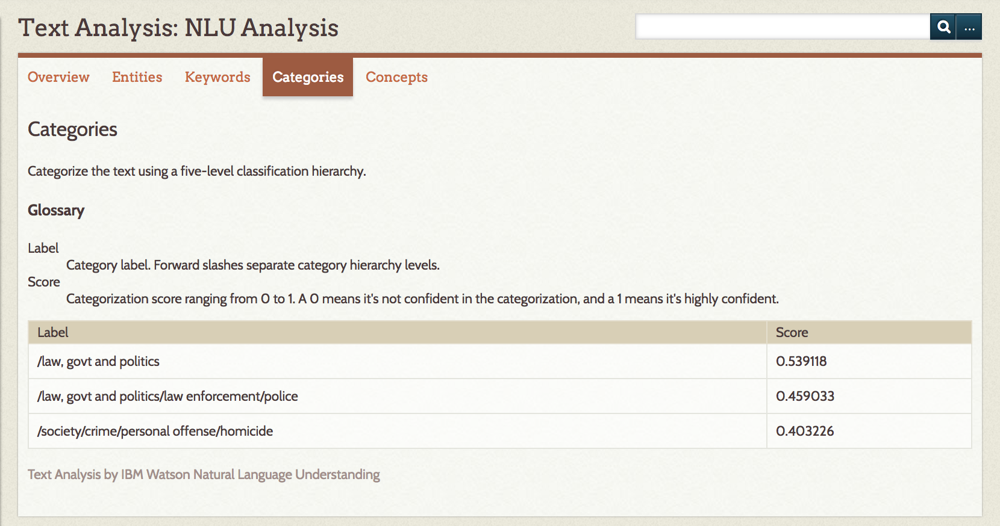
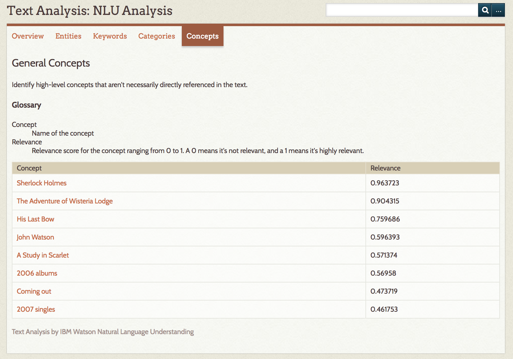
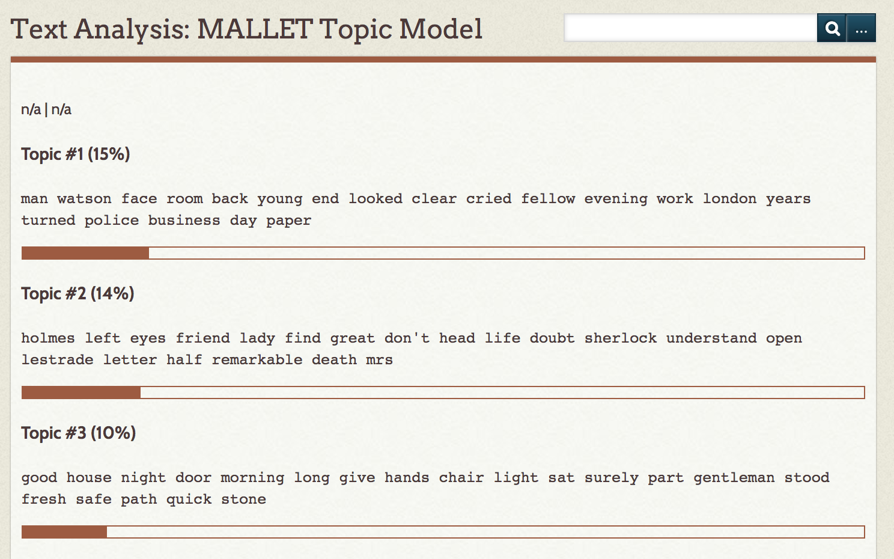

The Text Analysis plugin connects your Omeka Classic site with [Watson Natural Language Understanding](https://www.ibm.com/watson/developercloud/natural-language-understanding.html) and [Mallet](http://mallet.cs.umass.edu/) to enable text analysis on a corpora of items created using the Ngram plugin from items on your site.

In order to use Text Analysis you must have the [Ngram](/Ngram) plugin installed and activated.

The Text Analysis plugin uses two services: Watson NLU and MALLET Topic Modeling. Watson NLU will return the entities, keywords, and categories of a corpus; MALLET only returns topic models. You do not have to use both services but you must enter configurations for at least one in order to use this plugin.

Because using Watson NLU may incur costs, the functions of Text Analysis are restricted to users with super and admin permissions.

## Configuration
After you have installed the plugin, go to the Plugins tab in the upper navigation, and scroll down to Text Analysis. Click the blue Configure button.

The Configuration page has two sections, one for each service. 

To use **Watson Natural Language Understanding** (NLU) services to analyze text, you will need to create an [IBM Bluemix account](https://www.ibm.com/watson/developercloud/doc/natural-language-understanding/getting-started.html). Please note that there may be charges associated with using this service.

Once you have an account, enter your *Bluemix Username* and *Bluemix Password* in the two fields provided.

To use MALLET you must first [download and install](http://mallet.cs.umass.edu/download.php) the toolkit on your web server. It may be easiest to install it at the same level as your Omeka installation (so that the mallet and omeka folders are in the same location).

To find your *MALLET script directory*: go to your MALLET installation and navigate to the `/bin` folder. 

- If using a FTP client, copy the full path as listed in the browser bar of your client.
- From a ssh client, navigate to the mallet directory and type `pwd`, then copy and paste the resulting file path.

## Create a Corpus

### Create Corpus
To create a corpus, you will need to use the [Ngram](Ngram.md)  plugin (see that documentation for complete information on corpora). 

A corpus is drawn from the items in your collection with content in a particular text element (which is selected on the plugin configuration page), it is further defined by a Search Query and Sequence elements (on the Add a Corpus page), producing an Item Pool. The Item Pool will be further refined by Validating the Items.

To create a corpus, go to the Ngram tab on the left hand navigation of your Omeka admin dashboard. On the Browse Corpora page, click the green Add a Corpus button. 

On the Add a Corpus page, complete the following options:

**Name**: A field in which you must give the corpus a name. Ideally, choose something that meaningfully describes the corpora, as there are no descriptions for these corpora.

**Public**: A check box. Click the checkbox to make the corpus visible to public users (on the public side of the site).

**Search Query**: A field in which you refine the contents of your corpus by inputting a search query. The best way to get this search query is to perform an advanced search of the items in your collection on the Admin side of your Omeka site. Then, copy and paste the entire URL of the results, after the part that reads admin/items/browse?

**Sequence**: 
If you use sequence, you will select from these sequence elements when viewing your corpus' text analysis (both NLU and MALLET). To conduct a text analysis on the entire corpus, *do not* use a sequence.

- **Sequence Element**: select from elements but it should be something with numeric or date input. Items without the selected element field filled in (for instance, an item without a Date will not be included in the corpus). For best results, ensure consistency of metadata, and select a meaningful field.
- **Sequence type**: choose from Date by Year, Date by Month, Date by Day, or Numeric Sequence Range. The field will prompt you with the proper format for the sequence if you choose a Date type. If numeric, make sure the format matches the numeric sequence of the elements you’re drawing from.

**Note**: Date should be entered in the YearMonthDay format and should be entered as a range. (for instance, 20010101-20160101)

When you have completed adding your corpus, click the green Add Corpus button. 

### Validate Corpus
After the Corpus has been created you must validate items before you can generate ngrams and view frequencies. To do so, click the green Validate Items button on the right hand side (just below the Delete button).

This will take you to a new screen with three tabs: valid items, invalid items, and out of range items. 

**Valid items** are those items with sequence text that is readable to the plugin (See Figure 1). The table on this tab gives: 

- the item number (a link to the item),
- the text in the sequence element, and
- Sequence member, or how it will be used in sequence by the plugin (Ex. when the sequence is “Date by Year” and the Sequence. 

**Invalid items** have text in the sequence element which the plugin cannot parse (See Figure 2). However, you can click on the Item ID number to go in and edit the item to correct the element text. 

**Out of range items** have text in their sequence element which is outside the range you set (See Figure 3). The table on this tab gives:

- the item number (a link to the item), 
- the text in the sequence element, and 
- Sequence member, or how it will be used in sequence by the plugin (Ex. when the sequence is “Date by Year” and the Sequence 

**Note**: to update the sequence text in these items, utilize the linked item number to modify each item. If you do not modify out of range items, they will not be included in the corpus.

For ease of navigation, you may click to open a new tab for the invalid or out of range items you would like to modify. Refresh the list of valid and invalid items by reloading this page. Once you are done correcting invalid items, or the list of valid items looks correct, click the green Accept Valid Items button.

**Note**: Once you click the Accept Valid Items button you will not be able to reconfigure the item pool or reset the body of valid items

Valid Items (Figure 1)

Invalid Items (Figure 2)

Out of Range Items (Figure 3)

**Note**: After you have validated your items, the Item Counts pane will update to provide a count of the number of items in your corpus.

## Using Text Analysis

Once you have created at least one corpus, navigate to the Text Analysis tab in the left-hand navigation of your dashboard. 

### Analyze a corpus

To analyze one of your existing corpora, click the green *Analyze a corpus* button on the Text Analysis page.

On the page which loads:

1. *Corpus*: Select a corpus (generated with the Ngram plugin) to analyze from a dropdown menu of your Omeka site's existing corpora. Note that corpora cannot be analyzed until they have been validated.
2. *Features*: Using checkboxes, select which sorts of analysis you want to run on the corpus. For NLU you can select Entities, Keywords, Categories and Concepts. MALLET has a single checkbox.
3. *Item Cost Only?* Check this box to get an estimated cost of running NLU features on the selected corpus.
4. *Stopwords* (MALLET): If you want to add stopwords for MALLET, enter whitespaced-separated words in this text box. The [list of default stopwords for MALLET](https://github.com/mimno/Mallet/blob/master/stoplists/en.txt) includes most common English-language stopwords. Note that carriage returns will count as whitespace in this field, should you need to copy and paste a list of stopwords.

Once you have configured these settings, click the green *Analyze Corpus* button.

Once you have clicked the button, you will return to the main page for the Text Analysis plugin tab. The page will display the message "Analyzing the corpus. This may take some time. Feel free to navigate away from this page and close your browser. Refresh this page to see if the process is complete."  Corpora which are being processed will show up in the table of corpora with the Process status "In Progress"

### View analysis

Once you have analyzed at least one corpus, the Text Analysis page will display a table of analyzed corpora with the following columns:  

- *Name*: name of the corpus. Includes a delete button to remove this analysis.
- *Process*: will either display as "In Progress" or "Complete"
- *NLU Analysis*: Once the process is complete, the NLU Analysis column will display one or more of the following:
    - the item cost; 
    - either a dropdown to view analysis by sequence element (set in the corpus) or a link to *view* if there was no sequence element;
    - if you selected "Item Cost Only", this column will only display the cost of the running the processes.
- *MALLET Topic Model*: Once the process if complete, the MALLET Topic Model column will display either a dropdown to view topic models by sequence element (set in the corpus) or a link to *view* if there was no sequence element.

To view analysis, click view or select from the dropdown for MALLET or NLU. 

#### NLU Analysis
If your corpus had sequence elements, select one from the dropdown in order to view the analysis for that sequence. Otherwise, simply click View.

Viewing the NLU Analysis will present you with the following tabs, most of which correspond to various [AlchemyLanguage features](https://www.ibm.com/watson/developercloud/doc/natural-language-understanding/):

*Overview*: which summarizes the item and element analyzed, the word count for the element along with number of Unique words, the character count, text size, and the full text of the element being analyzed.

*Entities* displays a table of named [entities](https://www.ibm.com/watson/developercloud/doc/natural-language-understanding/entity-types.html) (as defined by NLU) in the text, with columns for entity, type, sentiment, count, and relevance. A glossary above the table defines each column.

*Keywords* displays keywords in a table with columns for the word or phrase, associated emotions, sentiment score, and keyword relevance score. keywords based on context and relevance in the overall text sample. A glossary above the table defines each column.

*Categories* applies the NLU [categories](https://www.ibm.com/watson/developercloud/doc/natural-language-understanding/categories.html) to your content. The table shows the label for the categories identified and the confidence score for that category.

*Concepts* are given in a table with the concept and relevance; the words and phrases are generated by computation extraction and may not be referenced in the text. 

Analysis will on display for those features which you selected when you ran the analysis. To see more features, re-run the analysis on that corpus and select the desired features. 

#### MALLET Analysis
If your corpus had sequence elements, select one from the dropdown in order to view the analysis for that sequence. Otherwise, simply click View.

All topics load on a single page. At the top of the page is an option to navigate between sequence elements. If you did not have a sequence element, this will load as n/a. 

Regardless of the size of the corpus (whether your corpus has 50 or 500 items), ten topics will be generated. Topics are displayed in order of occurrence, highest first. Each topic will display with its percentage and a cluster of words found in that topic. In this instance, percentage refers to the percentage of the sequence assigned to a given topic, or how relevant each topic is to the sequence. Each topic also comes with a line graph in order to enable users to visualize the percentage for that topic. Please note that not all topics will add up to 100%, as percentages are rounded up to the nearest whole number. 

