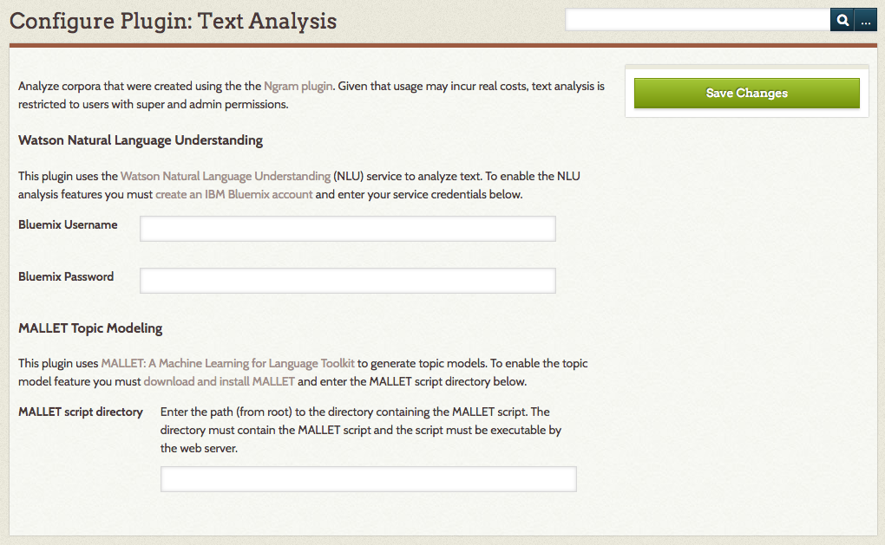
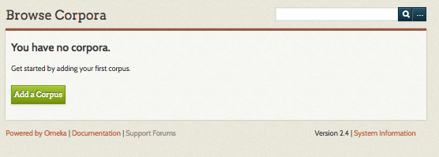

*Current version 2.5*

The Text Analysis plugin connects your Omeka Classic site with [Watson Natural Language Understanding](https://www.ibm.com/watson/developercloud/natural-language-understanding.html) and [Mallet](http://mallet.cs.umass.edu/) to enable text analysis on a corpora of items created using the Ngram plugin from items on your site.

In order to use Text Analysis you must have the [Ngram](../Plugins/Ngram.md) plugin installed and activated.

The Text Analysis plugin uses two services: Watson NLU and MALLET Topic Modeling. Watson NLU will return the entities, keywords, and categories of a corpus; MALLET only returns topic models. You do not have to use both services but you must enter configurations for at least one in order to use this plugin.

Because using Watson NLU may incur costs, the functions of Text Analysis are restricted to users with super and admin permissions.

## Configuration
After you have installed the plugin, go to the Plugins tab in the upper navigation, and scroll down to Text Analysis. Click the blue Configure button.

The Configuration page has two sections, one for each service. 

To use **Watson Natural Language Understanding** (NLU) services to analyze text, you will need to create an [IBM Bluemix account](https://www.ibm.com/watson/developercloud/doc/natural-language-understanding/getting-started.html). Please note that there may be charges associated with using this service.

Once you have an account, enter your *Bluemix Username* and *Bluemix Password* in the two fields provided.

To use MALLET you must first [download and install](http://mallet.cs.umass.edu/download.php) the toolkit on your web server. It may be easiest to install it at the same level as your Omeka installation (so that the mallet and omeka folders are in the same location).

To find your *MALLET script directory*: go to your MALLET installation and navigate to the `/bin` folder. 
	- If using a FTP client, copy the full path as listed in the browser bar of your client.
	- From a ssh client, navigate to the mallet directory and type `pwd`, then copy and paste the resulting file path.

## Create a Corpus

To create a corpus, you will need to use the Ngram plugin: 

A corpus is drawn from the items in your collection with content in a particular text element (which is selected on the plugin configuration page), it is further defined by a Search Query and Sequence elements (on the Add a Corpus page), producing an Item Pool. The Item Pool will be further refined by Validating the Items.

To create a corpus and start viewing ngrams, go to the Ngram tab on the left hand navigation of your Omeka admin dashboard. On the Browse Corpora page, click the green Add a Corpus button. 

On the Add a Corpus page, complete the following options:

**Name**: A field in which you must give the corpus a name. Ideally, choose something that meaningfully describes the corpora, as there are no descriptions for these corpora.

**Public**: A check box. Click the checkbox to make the corpus visible to public users (on the public side of the site).

**Search Query**: A field in which you refine the contents of your corpus by inputting a search query. The best way to get this search query is to perform an advanced search of the items in your collection on the Admin side of your Omeka site. Then, copy and paste the entire URL of the results, after the part that reads admin/items/browse?

**Sequence**: 
- **Sequence Element**: select from elements but it should be something with numeric or date input. Items without the selected element field filled in (for instance, an item without a Date will not be included in the corpus). For best results, ensure consistency of metadata, and select a meaningful field.
- **Sequence type**: choose from Date by Year, Date by Month, Date by Day, or Numeric Sequence Range. The field will prompt you with the proper format for the sequence if you choose a Date type. If numeric, make sure the format matches the numeric sequence of the elements you’re drawing from.

**Note**: Date should be entered in the YearMonthDay format and should be entered as a range. (for instance, 20010101-20160101)

**Note**: You do not have to have a sequence, but without one you cannot generate graphs. 

**Note**: The Text Element box under the green Add Corpus button on the Add Corpus page. The Text Element was configured in the plugin panel. 

When you have completed adding your corpus, click the green Add Corpus button. 

