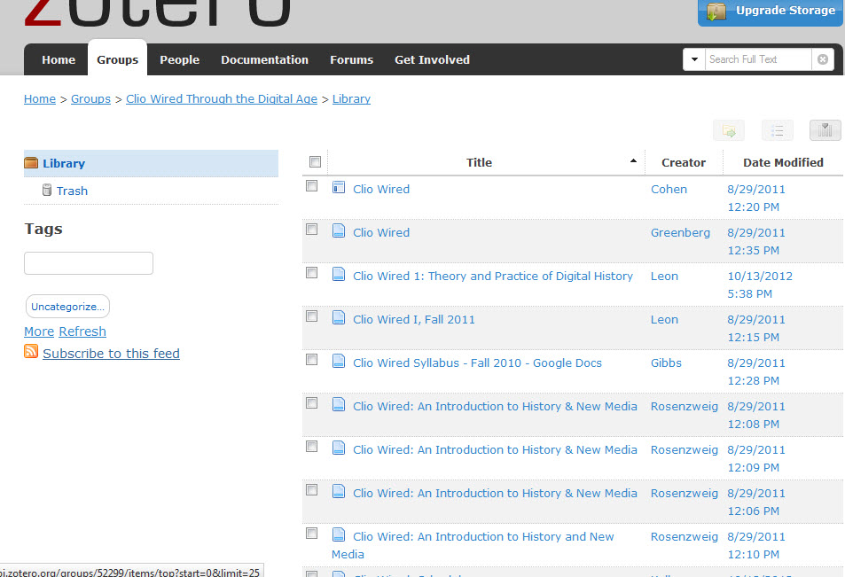
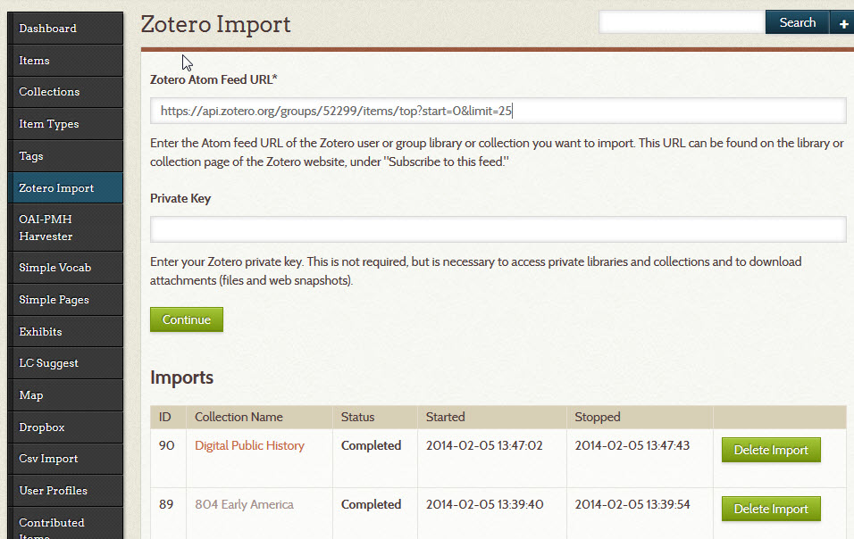

*Current version: 2.0.2*
With this plugin you can move your Zotero research into Omeka, making it possible to further organize and exhibit your Zotero library. Just sync your library to the Zotero server, tell the Zotero Import plugin what library you want to import, and it'll pull in source items, notes, files, and web snapshots.

Features
-------------------------------------------------------
The plugin imports Zotero libraries and collections, including source items, notes, files, and web snapshots. Web snapshots are zipped up directories containing the files needed to render the web snapshot.

To minimize data loss that often occurs when migrating between systems, the plugin adds a new element set to your Omeka install which contains elements identical to the fields used by Zotero.

In addition to mapping data to the Zotero element set, the plugin maps data to the native Dublin Core element set to maximize interoperability and ease integration with Omeka. The Zotero element set is large, but the plugin provides a helper function to build strings from the elements therein.

The plugin also adds a field to the advanced search page that narrows search results by Zotero item type. Every Zotero item has an item type, so it's a helpful way to sort through your items.

Requirements
---------------------------------------------------------------

-   **Sync Zotero library**: The Zotero library must be synced to the Zotero.org server prior to import. To import files, the Zotero client must be set to sync attachment files. You can find     instructions on how to do this at the [Zotero website](http://www.zotero.org/support/sync). 
     - *Note: the import will not work from Zotero Standalone.*

-   **Atom Feed URL**: Every Zotero library and collection has an Atom feed URL. You can find this URL on the library or collection page of the Zotero website, under "Subscribe to this feed." Unpublished libraries do not have a feed URL readily accessible, but you can construct it using the following URLs as templates:
    -   user library: `https://api.zotero.org/users/%7BuserID%7D/items`
    -   user collection: `https://api.zotero.org/users/%7BuserID%7D/collections/%7BcollectionKey%7D/items`
    -   group library: `https://api.zotero.org/groups/%7BgroupID%7D/items`
    -   group collection: `https://api.zotero.org/groups/%7BgroupID%7D/collections/%7BcollectionKey%7D/items`

The user or group owner can get you the userID, groupID, and
collectionID.

-   **Private key**: To access access private libraries and collections and to download attachments (files and web snapshots), a private key is required. A key is not necessary to access citations saved in public libraries and collections. The owner of the library can generate private keys in their [account settings](https://www.zotero.org/settings/keys/new). Private keys must be set to allow third party access.

**PHP Zip extension**: Zotero stores web snapshots in ZIP files
containing files with [Base64](http://en.wikipedia.org/wiki/Base64) encoded filenames. The import plugin attempts to decode the filenames using [PHP's Zip extension](http://www.php.net/manual/en/book.zip.php). If your server does not have this extension installed, the plugin does not decode the filenames. The import will still save web snapshots, but the filenames will be obfuscated, making access near-worthless.

Installation and Importing
---------------------------------------------------------------
If you want to import all file types, *you must disable file upload validation* in Omeka Admin &gt; Settings &gt; Security Settings before import.

Once you've [installed](../Managing_Plugins.md#installing-a-plugin) the plugin, go to the "Zotero Import" tab in the admin interface and fill out the form (/admin/zotero-import).

1. To fill out the form, you will need find the feed URL to the Zotero library you want to import and, if desired or necessary, a private key to access those sources. Click "Continue" to begin the importing process.

1. Depending on the size of the library, the import process may take some time to complete. Because of this we suggest that you log background processes:
     - In omeka/application/config/config.ini make sure `log.processes = true`
     - In omeka/application/logs/ make sure a processes.log file exists and is writable. 
     - These steps are not required but will be helpful if something goes wrong halfway through a long import. It's important to note that the import process is only as stable as the Zotero API. If you encounter errors, delete the import and try again.

Stopping and Deleting an Import
----------------------------------------------------------------
If you make a mistake, you may stop an import at any time by clicking "Stop Import" in the Zotero Import admin panel. You may also delete the items from an import after the process finishes, by clicking "Delete Import." Deleting imports will delete all imported items and files.